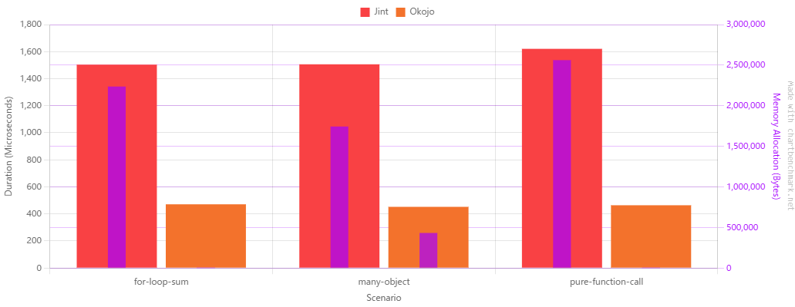

# Okojo


"Okojo" means "ermine" or "stoat" in Japanese.

Okojo is an experimental low allocation managed JavaScript engine for .NET, aimed at **correctness first**, strong observability/tooling, and practical host integration for modern ECMAScript workloads.

This repository contains the core engine, host/runtime layers, minimum web-platform api support, WebAssembly integration, code-generation helpers, examples, Test262 infrastructure, and internal sandboxes used to drive compatibility work.


## What Okojo is trying to be

The current direction is:

- a correct, observable JavaScript engine for .NET
- a clean embedding surface for host applications
- a base for browser-compatibility and Node-compatibility work
- a package set that can be consumed in layers instead of one monolithic runtime

The project is still **prerelease**. Public APIs and package boundaries are being refined, but the repo is already organized around the package wave expected to ship first.

## Current status
- core language and runtime correctness are the top priority
- non-legacy, non-staging Test262 baseline coverage is currently passing in the working baseline
- deprecated and legacy corners are intentionally not a priority unless explicitly re-approved
- Except for intentional legacy, direct-eval, and the skipping of with statements, the baseline passes **100%** of test262. [See Test262 Section](#test262-progress-and-compatibility-tracking)
- Unlike jint, its RegExp implementation is ECMAScript 262 compliant, although its performance is not very good.
- runtime support is currently **.NET 10+**
- core runtime packages are intended to stay **NativeAOT-friendly by default**
- browser-facing and Node-facing integration work is active, but not every `src/` project is part of the first public wave

## Performance

Although it is not as fast as other implementations that are famous for being more than just an interpreter, it is more than **3** times faster than [jint](https://github.com/sebastienros/jint). 

It is expected to become about **1.5** times faster through performance tuning.
I'd like to emphasize the **low allocation**.

[for-loop-sum.js](benchmarks/Okojo.Benchmarks/scripts/for-loop-sum.js)
[many-object.js](benchmarks/Okojo.Benchmarks/scripts/many-object.js)
[pure-function-call.js](benchmarks/Okojo.Benchmarks/scripts/pure-function-call.js)

https://chartbenchmark.net/

| Method | Scenario           | Mean       | Error     | StdDev   | Ratio | Gen0     | Allocated | Alloc Ratio |
|------- |------------------- |-----------:|----------:|---------:|------:|---------:|----------:|------------:|
| Jint   | for-loop-sum       | 1,503.6 us | 245.87 us | 13.48 us |  1.00 | 142.5781 | 2236280 B |       1.000 |
| Okojo  | for-loop-sum       |   471.0 us |  37.55 us |  2.06 us |  0.31 |        - |      88 B |       0.000 |
|        |                    |            |           |          |       |          |           |             |
| Jint   | many-object        | 1,506.1 us |  68.16 us |  3.74 us |  1.00 | 109.3750 | 1743560 B |        1.00 |
| Okojo  | many-object        |   452.2 us |  14.31 us |  0.78 us |  0.30 |  27.3438 |  432000 B |        0.25 |
|        |                    |            |           |          |       |          |           |             |
| Jint   | pure-function-call | 1,620.5 us | 293.68 us | 16.10 us |  1.00 | 162.1094 | 2561672 B |       1.000 |
| Okojo  | pure-function-call |   464.0 us |  19.73 us |  1.08 us |  0.29 |        - |     280 B |       0.000 |

Benchmark project:

```powershell
dotnet run --project benchmarks/Okojo.Benchmarks/Okojo.Benchmarks.csproj -c Release
```

The benchmark suite uses BenchmarkDotNet and includes compile, promise, async, property-path, global-binding, and Jint comparison scenarios under `benchmarks/Okojo.Benchmarks`.


## Public package wave

These are the `src/` packages currently marked `IsPackable=true` and intended as the public package wave.

| Package | NuGet | Role |
| --- | --- | --- |
| `Okojo` | [nuget.org/packages/Okojo](https://www.nuget.org/packages/Okojo) | Core engine, runtime, modules, compiler, embedding API |
| `Okojo.Hosting` | [nuget.org/packages/Okojo.Hosting](https://www.nuget.org/packages/Okojo.Hosting) | Host queues, schedulers, workers, and runtime helpers |
| `Okojo.Diagnostics` | [nuget.org/packages/Okojo.Diagnostics](https://www.nuget.org/packages/Okojo.Diagnostics) | Formatting, inspection, and disassembly helpers |
| `Okojo.Reflection` | [nuget.org/packages/Okojo.Reflection](https://www.nuget.org/packages/Okojo.Reflection) | Reflection-based CLR interop extensions |
| `Okojo.WebPlatform` | [nuget.org/packages/Okojo.WebPlatform](https://www.nuget.org/packages/Okojo.WebPlatform) | `fetch`, timers, workers, and web host APIs |
| `Okojo.WebAssembly` | [nuget.org/packages/Okojo.WebAssembly](https://www.nuget.org/packages/Okojo.WebAssembly) | Backend-agnostic WebAssembly integration |
| `Okojo.WebAssembly.Wasmtime` | [nuget.org/packages/Okojo.WebAssembly.Wasmtime](https://www.nuget.org/packages/Okojo.WebAssembly.Wasmtime) | Wasmtime backend for `Okojo.WebAssembly` |
| `Okojo.Annotations` | [nuget.org/packages/Okojo.Annotations](https://www.nuget.org/packages/Okojo.Annotations) | Attributes for Okojo globals and object export generation |
| `Okojo.SourceGenerator` | [nuget.org/packages/Okojo.SourceGenerator](https://www.nuget.org/packages/Okojo.SourceGenerator) | Roslyn source generator for Okojo export glue |
| `Okojo.DocGenerator.Annotations` | [nuget.org/packages/Okojo.DocGenerator.Annotations](https://www.nuget.org/packages/Okojo.DocGenerator.Annotations) | Attributes for declaration-file generation control |
| `Okojo.DocGenerator.Cli` | [nuget.org/packages/Okojo.DocGenerator.Cli](https://www.nuget.org/packages/Okojo.DocGenerator.Cli) | dotnet tool that emits TypeScript declaration files |

Not part of the current public package wave:

- `Okojo.Browser`
- `Okojo.Node`
- `Okojo.Node.Cli`
- `Okojo.Repl`
- debug server packages
- compiler experimental projects

## Quick start

```csharp
using Okojo;

using var runtime = JsRuntime.CreateBuilder().Build();

var realm = runtime.MainRealm;
var result = realm.Eval("1 + 2");

Console.WriteLine(result.NumberValue); // 3
```

Useful entry points:

- `JsRuntime.CreateBuilder()`
- `JsRuntime.Create(...)`
- `JsRuntime.MainRealm`
- `JsRuntime.CreateRealm()`
- `JsRealm.Eval(...)`
- `JsRealm.Execute(...)`
- `JsRealm.Import(...)`
- `JsRealm.LoadModule(...)`

## Platform support and AOT

Today, the runtime and host packages are supported on **.NET 10 and later**.

The core runtime packages are intended to remain **AOT-compatible by default**. In this repo, projects under `src/` default to `IsAotCompatible=true`, and the packages that are pure runtime/hosting surfaces are kept on that path unless they explicitly opt out.

The main exception is `Okojo.Reflection`, which is intentionally split out so that reflection-backed CLR interop stays opt-in instead of becoming part of the default runtime surface.

The build-time helper packages such as `Okojo.Annotations`, `Okojo.SourceGenerator`, and `Okojo.DocGenerator.Annotations` are separate from the runtime support story and can be used from projects that feed Okojo-based generation or declaration workflows.

## Core surface: `JsRuntime`, `JsRealm`, and `JsValue`

The main embedding shape is:

1. build a runtime
2. use a realm to evaluate scripts or modules
3. exchange values through `JsValue`

`JsValue` is the core public value type. It is a compact value container used for primitives, strings, objects, symbols, bigints, and host interop.

```csharp
using Okojo;

using var runtime = JsRuntime.Create();
var realm = runtime.MainRealm;

JsValue answer = 42;
JsValue label = "okojo";
JsValue computed = realm.Eval("({ total: 21 + 21, ok: true, label: 'okojo' })");

Console.WriteLine(answer.Int32Value);      // 42
Console.WriteLine(label.AsString());       // okojo
Console.WriteLine(computed.IsObject);      // True
Console.WriteLine(realm.Eval("21 + 21").NumberValue); // 42
```

Some commonly useful `JsValue` members:

- `IsNumber`, `IsString`, `IsObject`, `IsBool`, `IsNull`, `IsUndefined`
- `Int32Value`, `Float64Value`, `NumberValue`
- `AsString()`, `TryGetString(...)`
- `AsObject()`, `TryGetObject(...)`
- implicit conversions from `int`, `double`, `bool`, and `string`

## Installing host globals

You can install globals directly from the runtime builder without defining a full host object model.

```csharp
using Okojo;

using var runtime = JsRuntime.CreateBuilder()
    .UseGlobals(globals => globals
        .Value("answer", JsValue.FromInt32(42))
        .Function("sum", 2, static (in info) =>
        {
            var left = info.GetArgumentOrDefault(0, JsValue.FromInt32(0)).Int32Value;
            var right = info.GetArgumentOrDefault(1, JsValue.FromInt32(0)).Int32Value;
            return JsValue.FromInt32(left + right);
        }))
    .Build();

var result = runtime.MainRealm.Eval("answer + sum(5, 7)");
Console.WriteLine(result.Int32Value); // 54
```

That builder style is the preferred public composition path.

## Reflection-backed CLR access

If you want CLR namespace and type access from JavaScript, add `Okojo.Reflection` explicitly and opt into reflection-backed interop:

```csharp
using Okojo;
using Okojo.Reflection;

using var runtime = JsRuntime.CreateBuilder()
    .AllowClrAccess(typeof(Console).Assembly, typeof(Enumerable).Assembly)
    .Build();
```

From JavaScript, CLR access shows up through helper globals:

- `clr` - root CLR namespace object
- `$using(...)` - import CLR namespaces or types into a smaller resolver object
- `$place(type, value?)` - create a placeholder object for `ref` and `out` style arguments
- `$null(type)` - create a typed CLR null value
- `$cast(type, value)` - force CLR-side conversion

Minimal JavaScript-side examples:

```js
clr.System.Console.WriteLine("hello from CLR");

const sys = $using(clr.System);
sys.Console.WriteLine(sys.String.Concat("oko", "jo"));

const result = $place(clr.System.Int32);
const ok = clr.System.Int32.TryParse("42", result);
clr.System.Console.WriteLine(result.value);
```

That last pattern is the basic `ref` / `out` shape: pass a `$place(...)` object to the CLR call, then read the updated `.value` after invocation.

That split is deliberate:

- `Okojo` keeps the default embedding surface simpler and more AOT-friendly
- `Okojo.Reflection` is the opt-in package for reflection-based host interop

Useful references:

- `src/Okojo.Reflection/README.md`
- `src/Okojo.Reflection/ClrAccessExtensions.cs`
- `sandbox/OkojoRepl`
```
dotnet run --project .\sandbox\OkojoRepl\OkojoRepl.csproj 
```
## Modules

Okojo supports ECMAScript modules through the runtime loader surface.

```csharp
using Okojo;

var loader = new InMemoryModuleLoader(new Dictionary<string, string>
{
    ["/mods/main.js"] = "export const value = 1 + 2;"
});

using var runtime = JsRuntime.CreateBuilder()
    .UseModuleSourceLoader(loader)
    .Build();

JsValue ns = runtime.MainRealm.Import("/mods/main.js");
Console.WriteLine(ns);
```

There are runnable module-focused examples under:

- `examples/OkojoModuleSample`
- `examples/OkojoModuleSampleRunner`
- `sandbox/OkojoProbeSandbox`

## Hosting and web APIs

`Okojo.Hosting` and `Okojo.WebPlatform` are intended for hosts that need event loops, timers, workers, fetch, and queue control.

The host sandbox examples show both browser-like and server-like queue wiring:

```csharp
var runtime = JsRuntime.CreateBuilder()
    .UseTimeProvider(timeProvider)
    .UseLowLevelHost(host => host.UseTaskScheduler(eventLoop))
    .UseWebDelayScheduler(eventLoop)
    .UseWebTimerQueue(WebTaskQueueKeys.Timers)
    .UseAnimationFrameQueue(WebTaskQueueKeys.Rendering)
    .UseFetchCompletionQueue(WebTaskQueueKeys.Network)
    .UseModuleSourceLoader(moduleLoader)
    .UseBrowserGlobals(fetch => fetch.HttpClient = httpClient)
    .Build();
```

If you want a smaller default set for timers, delays, and related runtime globals, the examples also use:

```csharp
var runtime = JsRuntime.CreateBuilder()
    .UseWebRuntimeGlobals()
    .Build();
```

Useful references:

- `examples/OkojoHostEventLoopSandbox`
- `examples/OkojoGameLoopSandbox`
- `src/vscode-debug/extension`
- `tests/Okojo.Tests/AgentJobQueueTests.cs`
- `tests/Okojo.Tests/AsyncAwaitTests.cs`

## WebAssembly and Wasmtime

`Okojo.WebAssembly` provides the backend-agnostic WebAssembly integration surface. `Okojo.WebAssembly.Wasmtime` provides a packaged Wasmtime backend.

The Wasmtime-backed setup looks like this:

```csharp
using Okojo.WebAssembly.Wasmtime;

using var runtime = NodeRuntime.CreateBuilder()
    .UseWebAssembly(wasm => wasm
        .UseBackend(static () => new WasmtimeBackend())
        .InstallGlobals())
    .Build();
```

Useful references:

- `sandbox/OkojoInkProbe`
- `src/Okojo.WebAssembly`
- `src/Okojo.WebAssembly.Wasmtime`

## Node-like execution and InkProbe

`Okojo.Node` and `Okojo.Node.Cli` are not in the current public package wave yet, but they are already useful as integration and bring-up surfaces.

The `okojonode` CLI supports script execution, eval, printing, and debugger-oriented entry points:

```text
okojonode <script> [arguments]
okojonode inspect <script> [arguments]
okojonode -e <code>
okojonode -p <code>
```

One practical way to exercise the current Node-like stack is to run the InkProbe app through the CLI:

```powershell
dotnet run -c Release --project src/Okojo.Node.Cli/Okojo.Node.Cli.csproj sandbox/OkojoInkProbe/app/main.mjs
```

InkProbe itself is the focused sandbox for the same stack and is useful when you want a reduced Wasmtime-enabled repro with optional debugger logging:

```powershell
dotnet run --project sandbox/OkojoInkProbe/OkojoInkProbe.csproj -c Release -- --debugger
```

Useful references:

- `sandbox/OkojoInkProbe`
- `src/Okojo.Node.Cli/NodeCliApplication.cs`
- `docs/OKOJO_NODE_INK_DEBUG_WORKFLOW.md`

## Source generation with `Okojo.Annotations` and `Okojo.SourceGenerator`

`Okojo.Annotations` and `Okojo.SourceGenerator` are for strongly-typed host APIs that should become JavaScript globals or generated object bindings.

Example shape:

```csharp
using Okojo.Annotations;
using Okojo.DocGenerator.Annotations;

[GenerateJsGlobals]
[DocDeclaration("globals")]
internal sealed partial class SketchGlobals
{
    [JsGlobalProperty("width")]
    public int Width => 320;

    [JsGlobalProperty("strokeWidth", Writable = true)]
    public int StrokeWidth { get; set; } = 2;

    [JsGlobalFunction("background")]
    private void Background(byte r, byte g, byte b) { }

    [JsGlobalFunction("sumNumbers")]
    private int SumNumbers(ReadOnlySpan<int> values) => values.ToArray().Sum();
}
```

Then install the generated globals:

```csharp
var globals = new SketchGlobals();

using var runtime = JsRuntime.CreateBuilder()
    .UseGlobals(globals.InstallGeneratedGlobals)
    .Build();
```

Real references:

- `examples/OkojoArtSandbox/SketchRuntime.cs`
- `tests/Okojo.Tests/GeneratedGlobalInstallerTests.cs`

## Generated object bindings and doc annotations

`GenerateJsObjectAttribute` is for object-style bindings. `DocDeclarationAttribute` and `DocIgnoreAttribute` control declaration output.

```csharp
using Okojo;
using Okojo.Annotations;
using Okojo.DocGenerator.Annotations;

[GenerateJsObject]
[DocDeclaration("Foo/Bar", "Docs.Shapes")]
public partial class GeneratedHostBindingSample
{
    public float X { get; set; }

    public static int SumNumbers(ReadOnlySpan<int> values)
    {
        var sum = 0;
        foreach (var value in values)
            sum += value;
        return sum;
    }

    [DocIgnore]
    public string Echo(string value) => $"echo:{value}";

    public static string DescribeJsValues(ReadOnlySpan<JsValue> values)
    {
        if (values.Length == 0)
            return string.Empty;
        return string.Join("|", values.ToArray());
    }
}
```

Real references:

- `examples/OkojoArtSandbox/GeneratedObjectSample.cs`
- `tests/Okojo.Tests/HostInteropTests.cs`

## Declaration generation with `Okojo.DocGenerator.Cli`

`Okojo.DocGenerator.Cli` is a dotnet tool that walks a project, finds `[GenerateJsGlobals]` and `[GenerateJsObject]` types, and emits TypeScript declaration files.

It also carries XML documentation comments into the generated declarations, including `summary` text and `param` descriptions, so the emitted `.d.ts` can preserve useful TSDoc-style API help.

```powershell
dotnet tool install --global Okojo.DocGenerator.Cli
okojo-docgen --project ./src/MyProject/MyProject.csproj --out ./artifacts/types/globals.d.ts
```

Per-type output:

```powershell
okojo-docgen --project ./src/MyProject/MyProject.csproj --out ./artifacts/types --per-type
```

Real run against `examples/OkojoArtSandbox/OkojoArtSandbox.csproj`:

```powershell
dotnet run --project ./src/Okojo.DocGenerator.Cli/Okojo.DocGenerator.Cli.csproj -c Release -- --project ./examples/OkojoArtSandbox/OkojoArtSandbox.csproj --out ./artifacts/docgen-readme --per-type
```

Generated files:

- `artifacts/docgen-readme/globals.d.ts`
- `artifacts/docgen-readme/objects/GeneratedObjectSample.d.ts`

Excerpt from the generated `globals.d.ts`:

```ts
/**
 * Requests a sketch canvas size in pixels.
 * @param width Requested canvas width.
 * @param height Requested canvas height.
 */
declare function createCanvas(width?: number, height?: number): void;

declare function background(color: string): void;
declare function background(gray: number): void;
declare function background(gray: number, alpha: number): void;
declare function background(r: number, g: number, b: number): void;
declare function background(r: number, g: number, b: number, a: number): void;

declare const width: number;
declare const height: number;
declare const frameCount: number;
```

That comment block comes from the C# XML doc comment on `createCanvas`:

```csharp
/// <summary>Requests a sketch canvas size in pixels.</summary>
/// <param name="width">Requested canvas width.</param>
/// <param name="height">Requested canvas height.</param>
[JsGlobalFunction("createCanvas")]
private void CreateCanvas(int width = 960, int height = 720) { }
```

Excerpt from the generated object declaration:

```ts
declare namespace OkojoArtSandbox {
    class GeneratedObjectSample {
        Name: string;
        Age: number;
        DoSomething(): boolean;
    }
}
```

The tool entry point lives in `src/Okojo.DocGenerator.Cli/Program.cs`.

## VS Code debugger

There is also an in-repo VS Code debugger scaffold under `src/vscode-debug/extension`.

Current capabilities include:

- debugger contribution and configuration provider
- inline adapter that launches `src/Okojo.DebugServer`
- paused stack, locals, and source inspection from debug-server checkpoints
- source breakpoints by `sourcePath:line`
- `stopOnEntry` support

Quick local run:

```powershell
cd src/vscode-debug/extension
npm install
npm run compile
```

Then open `src/vscode-debug/extension` in VS Code, press `F5`, and use the sample workspace under `samples/okojo-debugger-workspace`.

## Useful examples and sandboxes

If you want concrete code before reading internals, start here:

| Path | What it shows |
| --- | --- |
| `examples/OkojoModuleSample` | ES module import/export behavior with a runnable sample |
| `examples/OkojoModuleSampleRunner` | Installing a small host `console` and evaluating a module entry point |
| `examples/OkojoHostEventLoopSandbox` | Browser-like queue wiring for timers, animation frames, and fetch |
| `examples/OkojoGameLoopSandbox` | Frame-budgeted execution, module loading, and manual event-loop pumping |
| `examples/OkojoArtSandbox` | Generated globals and objects driving an interactive sketch host |
| `benchmarks/Okojo.Benchmarks` | BenchmarkDotNet suite for runtime, object-path, promise, compile, and Jint-comparison scenarios |
| `sandbox/OkojoRuntimeDebugSandbox` | Runtime debugger checkpoints, breakpoints, module vs script execution |
| `sandbox/OkojoProbeSandbox` | Small probes for script/module execution and namespace inspection |
| `sandbox/OkojoInkProbe` | Node-like host with Wasmtime-enabled WebAssembly support |
| `src/Okojo.Node.Cli` | Node-like CLI entry point for scripts, eval, print, inspect, and InkProbe launching |
| `src/vscode-debug/extension` | VS Code debugger adapter scaffold and sample workspace integration |

## `src/` project map

`src/` contains both the public package wave and repo-internal projects used for host integration, tooling, experiments, and debugging. Being under `src/` does **not** mean a project is intended for near-term NuGet publication.

| Project | Role | Publication status |
| --- | --- | --- |
| `Okojo` | Core engine, runtime, compiler, modules, embedding API | Public package wave |
| `Okojo.Hosting` | Host queues, scheduling, worker helpers | Public package wave |
| `Okojo.Diagnostics` | Formatting, inspection, disassembly helpers | Public package wave |
| `Okojo.Reflection` | Reflection-backed CLR interop extensions | Public package wave |
| `Okojo.WebPlatform` | Host-installed web APIs such as fetch, timers, workers | Public package wave |
| `Okojo.WebAssembly` | Backend-agnostic WebAssembly integration surface | Public package wave |
| `Okojo.WebAssembly.Wasmtime` | Wasmtime backend for `Okojo.WebAssembly` | Public package wave |
| `Okojo.Annotations` | Shared annotations for source generation and tooling | Public package wave |
| `Okojo.SourceGenerator` | Roslyn source generator used by Okojo export patterns | Public package wave |
| `Okojo.DocGenerator.Annotations` | Doc generation annotation types | Public package wave |
| `Okojo.DocGenerator.Cli` | Documentation generator dotnet tool | Public package wave |
| `Okojo.Browser` | Browser-oriented host and integration surface | Not in current NuGet wave |
| `Okojo.Node` | Node-compatibility host and runtime layer | Not in current NuGet wave |
| `Okojo.Node.Cli` | Dotnet tool for the Node-like CLI host | Packable tool, intentionally outside the current public workflow |
| `Okojo.Repl` | Interactive shell and console-facing runtime host | Internal and dev-focused for now |
| `Okojo.DebugServer` | Debug transport and server host | Internal diagnostics infrastructure |
| `Okojo.DebugServer.Core` | Shared debug server core types | Internal diagnostics infrastructure |
| `vscode-debug/extension` | VS Code debugger adapter and launch configuration support | Internal tooling |
| `Okojo.Compiler.Experimental` | Experimental compiler work | Experimental and internal |

Package/versioning/publishing strategy for the packable projects is documented in [docs/OKOJO_PACKABLE_PACKAGE_WORKFLOW.md](docs/OKOJO_PACKABLE_PACKAGE_WORKFLOW.md).

## Requirements

- .NET 10 SDK

## Development

Fast local validation loop:

```powershell
dotnet test tests/Okojo.Tests/Okojo.Tests.csproj
```

Focused Test262 example:

```powershell
dotnet run --project ./tools/Test262Runner/ -c Release --filter test262/test/language
```

## Test262 progress and compatibility tracking{#test262}

This repo tracks compatibility progress in checked-in artifacts so work can be prioritized by **passed**, **failed**, and **classified skip** status rather than a single aggregate number.
[TEST262_PROGRESS_INCREMENTAL.md](TEST262_PROGRESS_INCREMENTAL.md)
Important files:

| File | Purpose |
| --- | --- |
| [`TEST262_PROGRESS_INCREMENTAL.md`](TEST262_PROGRESS_INCREMENTAL.md) | Human-readable progress snapshot grouped by category and folder, including passed, failed, and split skip classes |
| `TEST262_PROGRESS_INCREMENTAL.json` | Machine-readable version of the same incremental progress data (gitignored)|
| [`docs/TEST262_SKIP_TAXONOMY.md`](docs/TEST262_SKIP_TAXONOMY.md) | Skip classification policy and grouped skip inventory |
| `tools/Test262Runner` | Runner and progress generation logic |

### How to read `TEST262_PROGRESS_INCREMENTAL.md`

The main columns are:

- **Passed** - tests currently passing
- **Failed** - tests currently failing
- **Skip Std** - baseline ECMAScript coverage intentionally skipped for now
- **Skip Legacy** - deprecated legacy coverage intentionally not prioritized
- **Skip Annex B** - Annex B coverage tracked separately from other legacy behavior
- **Skip Proposal** - proposal and staging work not part of the baseline target
- **Skip Finished** - finished proposals that are still intentionally outside the current carried baseline
- **Skip Other** - intentional exceptions or non-standard buckets that do not fit the above
- **Baseline Passed %** - completion percentage after excluding non-baseline skip classes from the denominator

That last column is usually the best single number to use for practical baseline progress discussions.

## Key docs

- [`OKOJO_BROWSER_COMPATIBILITY_PLAN.md`](OKOJO_BROWSER_COMPATIBILITY_PLAN.md) - top-level compatibility direction
- [`docs/TEST262_SKIP_TAXONOMY.md`](docs/TEST262_SKIP_TAXONOMY.md) - skip taxonomy and inventory
- [`docs/OKOJO_PACKABLE_PACKAGE_WORKFLOW.md`](docs/OKOJO_PACKABLE_PACKAGE_WORKFLOW.md) - packable package versioning and publishing strategy

## Licensing

See [LICENSE](LICENSE) and [THIRD_PARTY_NOTICES.md](THIRD_PARTY_NOTICES.md).
